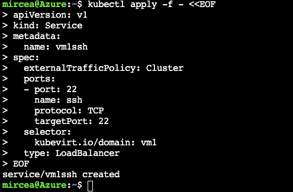
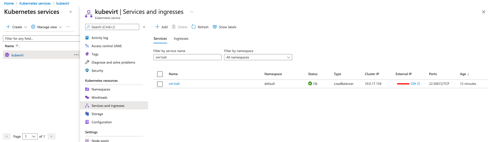
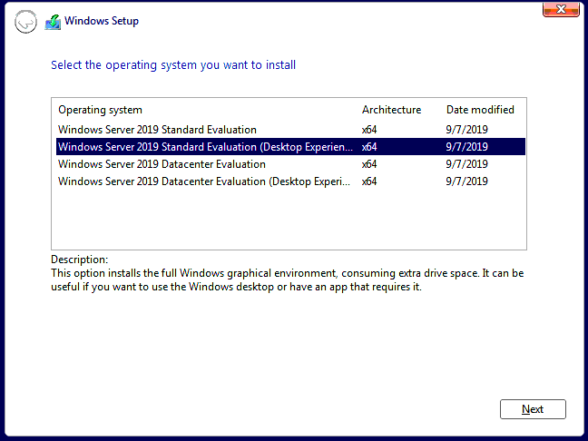

# Inversion of Containers

Inversion of Cont...ainers with Kubevirt  

- [Inversion of Containers](#inversion-of-containers)
- [Introduction](#introduction)
- [Using Azure Kubernetes Service infrastructure](#using-azure-kubernetes-service-infrastructure)
  - [Documentation sources](#documentation-sources)
  - [Prerequisites](#prerequisites)
    - [Mandatory: An Azure subscription](#mandatory-an-azure-subscription)
    - [Mandatory: Azure CLI (az)](#mandatory-azure-cli-az)
        - [Windows setup](#windows-setup)
        - [MacOS/Linux setup](#macoslinux-setup)
      - [Notes: Azure CLI or Cloud Shell](#notes-azure-cli-or-cloud-shell)
    - [Mandatory: Kubernetes CLI (kubectl)](#mandatory-kubernetes-cli-kubectl)
        - [Windows setup](#windows-setup-1)
        - [MacOS/Linux setup](#macoslinux-setup-1)
    - [Mandatory: Krew (plugin manager for kubectl)](#mandatory-krew-plugin-manager-for-kubectl)
        - [Windows setup](#windows-setup-2)
        - [MacOS/Linux setup](#macoslinux-setup-2)
    - [Mandatory: Docker CLI](#mandatory-docker-cli)
    - [Mandatory: VNC viewer](#mandatory-vnc-viewer)
        - [Windows setup](#windows-setup-3)
        - [MacOS/Linux setup](#macoslinux-setup-3)
    - [Mandatory: Vagrant](#mandatory-vagrant)
        - [Windows setup](#windows-setup-4)
        - [MacOS/Linux setup](#macoslinux-setup-4)
    - [Mandatory: VirtualBox](#mandatory-virtualbox)
        - [Windows setup](#windows-setup-5)
        - [MacOS/Linux setup](#macoslinux-setup-5)
  - [AKS Infrastructure setup](#aks-infrastructure-setup)
    - [Create a resource group](#create-a-resource-group)
    - [Create the kubernetes cluster](#create-the-kubernetes-cluster)
      - [Version Skew Policy](#version-skew-policy)
      - [Troubleshooting: SSH key is required](#troubleshooting-ssh-key-is-required)
    - [Add a second nodepool for nested virtualization](#add-a-second-nodepool-for-nested-virtualization)
    - [Set the subscription and get access credentials for the cluster](#set-the-subscription-and-get-access-credentials-for-the-cluster)
      - [Azure Cloud Shell](#azure-cloud-shell)
      - [Local computer](#local-computer)
    - [Check the cluster](#check-the-cluster)
  - [Deploy KubeVirt](#deploy-kubevirt)
    - [Deploy the KubeVirt operator and custom resources definitions](#deploy-the-kubevirt-operator-and-custom-resources-definitions)
    - [Install the command line tool virtctl](#install-the-command-line-tool-virtctl)
      - [Installation as a kubectl plugin](#installation-as-a-kubectl-plugin)
      - [Optional: Azure Cloud Shell](#optional-azure-cloud-shell)
    - [Verify components](#verify-components)
  - [Demo 1: Creating the first Fedora Linux VM using a public docker container image](#demo-1-creating-the-first-fedora-linux-vm-using-a-public-docker-container-image)
    - [Create ssh secret to be injected into VM](#create-ssh-secret-to-be-injected-into-vm)
    - [Create the VM object](#create-the-vm-object)
    - [Check the deployment](#check-the-deployment)
    - [Create a load balancer service](#create-a-load-balancer-service)
    - [Check the access to the VM](#check-the-access-to-the-vm)
    - [Delete or Stop the VM and release the resources](#delete-or-stop-the-vm-and-release-the-resources)
  - [Demo 2: Creating the first Windows VM using a private Azure docker registry](#demo-2-creating-the-first-windows-vm-using-a-private-azure-docker-registry)
    - [Creating an environment variable for the name of container registry](#creating-an-environment-variable-for-the-name-of-container-registry)
    - [Create a Microsoft.ContainerRegistry resource](#create-a-microsoftcontainerregistry-resource)
    - [Check the Acces Keys](#check-the-acces-keys)
    - [Create an image pull secret](#create-an-image-pull-secret)
    - [Login into the registry](#login-into-the-registry)
    - [Create the docker instructions file](#create-the-docker-instructions-file)
    - [Build and push the image](#build-and-push-the-image)
    - [Create a persistent volume claim](#create-a-persistent-volume-claim)
    - [Create the Windows VM](#create-the-windows-vm)
    - [Access the VM with VNC and complete the installation](#access-the-vm-with-vnc-and-complete-the-installation)
    - [Access the kubevirt VM with RDP](#access-the-kubevirt-vm-with-rdp)
  - [Demo 3: Experiment with CDI. Importing a custom FreeBSD image created with Vagrant](#demo-3-experiment-with-cdi-importing-a-custom-freebsd-image-created-with-vagrant)
    - [Install the CDI](#install-the-cdi)
    - [Verify the deployment](#verify-the-deployment)
    - [Create a custom FreeBSD VM using Vagrant](#create-a-custom-freebsd-vm-using-vagrant)
      - [Deploy the FreeBSD box](#deploy-the-freebsd-box)
      - [Poweroff the VM](#poweroff-the-vm)
    - [Use CDI to Import a Disk Image](#use-cdi-to-import-a-disk-image)
      - [Create the data volume](#create-the-data-volume)
      - [Start the port forwarding to the CDI upload service](#start-the-port-forwarding-to-the-cdi-upload-service)
      - [Create a token and use curl to upload the image](#create-a-token-and-use-curl-to-upload-the-image)
    - [Create the VM and attach the uploaded data volume](#create-the-vm-and-attach-the-uploaded-data-volume)
    - [Connect to the VM with VNC](#connect-to-the-vm-with-vnc)
    - [Connect to the VM httpd using a load balancer service](#connect-to-the-vm-httpd-using-a-load-balancer-service)
- [Grand finale](#grand-finale)


# Introduction

The current demo will show how to use kubevirt for deploying non containerizable workloads as VM into kubernetes cluster. It is a hands-on exercise attached to this [presentation](docs/InversionOfContainers.pdf)

# Using Azure Kubernetes Service infrastructure

This section will present use cases based on Azure Kubernetes Service.

## Documentation sources 

https://medium.com/cooking-with-azure/using-kubevirt-in-azure-kubernetes-service-part-1-8771bfb94d7  
https://medium.com/cooking-with-azure/using-kubevirt-in-azure-kubernetes-service-part-2-178396939aee  
https://medium.com/cooking-with-azure/using-kubevirt-in-azure-kubernetes-service-part-3-windows-vm-363d6b653d7  

## Prerequisites 

For the sake of simplicity, the installation tasks will be performed with:

- [Chocolatey](https://chocolatey.org/) for Windows OS
- [Homebrew](https://formulae.brew.sh/) for MacOS/Linux OS

### Mandatory: An [Azure subscription](https://portal.azure.com/#home)

The current demo can be completed with a minimal subscription. It can be:

- a student version with 100$ [credit](https://www.microsoftazuresponsorships.com/Balance)
- a dev essentials version with 200$ [credit](https://www.microsoftazuresponsorships.com/Balance)
- a pay-as-you-go (depending on the speed of progress, it will charge less than 20$)

### Mandatory: Azure CLI (az)

Check [here](https://docs.microsoft.com/en-us/cli/azure/install-azure-cli) for installation instructions.

##### Windows setup

```powwershell
# open an administrative Power Shell console
choco install azure-cli
```

##### MacOS/Linux setup

```bash
brew install azure-cli
```

#### Notes: Azure CLI or Cloud Shell

Most of the demo steps can be completed by using the online Azure Cloud Shell CLI with the following exceptions:

- downloading the Windows image was completed on the local machine
- creating the custom docker image was completed on the local machine
- running the Vncviewer
- deploying Vagrant boxes

Accessing the AKS can be performed:

- remotely in [Azure Cloud Shell](https://shell.azure.com/)
- by installing Azure CLI on the local machine. 

If you are using the local installation of the Azure CLI and you are managing several tenants and subscriptions, run the login command first and add your subscription. See [here](https://docs.microsoft.com/en-us/cli/azure/authenticate-azure-cli) different authentication methods.

```bash
# accessing from localhost
az login
```


### Mandatory: Kubernetes CLI (kubectl)

Check [here](https://kubernetes.io/docs/tasks/tools/) for installation instructions.

##### Windows setup

```powwershell
# open an administrative Power Shell console
choco install kubernetes-cli
```

##### MacOS/Linux setup

```bash
brew install kubernetes-cli
```

### Mandatory: Krew (plugin manager for kubectl)

Check [here](https://krew.sigs.k8s.io/docs/user-guide/setup/install/) for installation instructions.

##### Windows setup

```powwershell
# open an administrative Power Shell console
choco install krew
```

##### MacOS/Linux setup

```bash
brew install krew
```


### Mandatory: Docker CLI

In order to be able to build the custom images containing disks with Iso files, the docker CLI is needed. Install Docker Desktop on your localbox. Depending on your OS use the proper installation guide:

- Mac https://docs.docker.com/docker-for-mac/install/
- Windows https://docs.docker.com/docker-for-windows/install/

### Mandatory: VNC viewer

In order to access the VM, we need a machine with VNC viewer installed and added to the PATH.

##### Windows setup

```powwershell
# open an administrative Power Shell console
choco install vnc-viewer
$env:Path += ";C:\Program Files\RealVNC\VNC Viewer"
```

##### MacOS/Linux setup

```bash
brew install --cask vnc-viewer
```

### Mandatory: Vagrant

See [here](https://www.vagrantup.com/downloads) various installers for your OS

##### Windows setup

```powwershell
# open an administrative Power Shell console
choco install vagrant
```

##### MacOS/Linux setup

```bash
brew install --cask vagrant
```

### Mandatory: VirtualBox

In order to be able to complete the demo on multiple operating systems, VirtualBox is the recommended virtualization provider for Vagrant deployments. Check this [page](https://www.virtualbox.org/wiki/Downloads) for installation options.

##### Windows setup

```powwershell
# open an administrative Power Shell console
choco install virtualbox
```

##### MacOS/Linux setup

```bash
brew install --cask virtualbox
```


## AKS Infrastructure setup

### Create a resource group

All the resources will be created under a single resource group named **k8s**. Having everything in one basket will permit to purge all resources in a single step and cut all the subsequent costs. The following command is using westeurope as location. If it's the case, change it according to your own needs.

```bash
az group create --location westeurope -n k8s 
```


### Create the kubernetes cluster

The cluster will be a basic 1-node. The node vm size is a two core in order to not exceed the allowed resources for the current subscription.
Check compatible versions between the client and the server (see [Version Skew Policy](#version-skew-policy)) 

```bash
kubectl version --client=true
az aks get-versions -l=westeurope -o=table
```


We will create a kubernetes cluster with a specific version in order to keep track of the compatible versions (±1 minor) for kube client and server.

```bash
az aks create \
--resource-group k8s \
--network-policy calico \
--network-plugin kubenet \
--node-vm-size Standard_D2s_v3 \
--node-count 1 \
--name kubevirt \
--kubernetes-version 1.20.7
```


#### Version Skew Policy

---

**NOTE**

For kubectl there is a compatibility requirement between client and server versions. Read [this](https://kubernetes.io/releases/version-skew-policy/) for version skew policy

---

#### Troubleshooting: SSH key is required

If you are using the AzCLI for the first time and you don't have a ssh key pair already generated, you will receive a warning with info and hints how to solve. 


There are two options to solve the issue:
- Try again and add the generate-ssh-keys switch to the "az aks create"
- Use ssh-keygen command to create the key pair and reissue the "az aks create"

Using the recommended switch is presented in the following image


Wait for the command completion. 

If the command gets stuck, reissue again.

### Add a second nodepool for nested virtualization

We will create a second nodepool with a VM that has the Intel virtualization extensions (VT-x) enabled (those from the Ds_v3 series all have them). The node vm size is a two core in order to not exceed the allowed resources for the current subscription

```bash
az aks nodepool add \
--resource-group k8s \
--cluster-name kubevirt \
--name nested \
--node-vm-size Standard_D2s_v3 \
--labels nested=true \
--node-count 1 
```


After running the commands, the kubevirt nodepools will be presented as in the following figure.


### Set the subscription and get access credentials for the cluster

Select Overview section from the menu. Click the Connect button. A "Connect to kubevirt" side panel will present Connection hints. 


Copy and run the commands from item 2.

#### Azure Cloud Shell

On Azure Cloud Shell, setting the subscription can be skipped considering the current subscription is the same as the one that was used for settng the cluster.

```bash
az aks get-credentials -g k8s -n kubevirt
```


#### Local computer

```bash
az account set --subscription <yoursubscription_from_azure_kubevirt_connect>
az aks get-credentials -g k8s -n kubevirt
```


### Check the cluster

The command line tool for Kubernetes is kubectl and it's available by default wihtin the Azure Cloud Shell.

```bash
kubectl get nodes
```


## Deploy KubeVirt

### Deploy the KubeVirt operator and custom resources definitions

```bash
# The version that was used for this demo is v0.43.0
export VERSION=$(curl -s https://api.github.com/repos/kubevirt/kubevirt/releases | grep tag_name | grep -v -- '-rc' | sort -r | head -1 | awk -F': ' '{print $2}' | sed 's/,//' | xargs)
echo $VERSION
kubectl create -f https://github.com/kubevirt/kubevirt/releases/download/${VERSION}/kubevirt-operator.yaml
```


```bash
kubectl create -f https://github.com/kubevirt/kubevirt/releases/download/${VERSION}/kubevirt-cr.yaml
```


### Install the command line tool virtctl

The virtctl provides commands for:

- starting/stopping the vm
- live migrating the vm
- uploading virtual machine disk images

More info [here](https://kubevirt.io/user-guide/operations/virtctl_client_tool/). Can be installed:

- as a binary executable (for advanced features). Will be used as ```virtctl <command>...```
- as a plugin via the krew plugin manager. Will be used as ```kubectl virt <command>...```

#### Installation as a kubectl plugin

```bash
kubectl krew install virt
```

#### Optional: Azure Cloud Shell

For Azure Cloud shell a full installation can be performed. 

```bash
# The script is dedicated for Azure Cloud Shell
VERSION=$(kubectl get kubevirt.kubevirt.io/kubevirt -n kubevirt -o=jsonpath="{.status.observedKubeVirtVersion}")
ARCH=$(uname -s | tr A-Z a-z)-$(uname -m | sed 's/x86_64/amd64/') || windows-amd64.exe
echo ${ARCH}
curl -L -o virtctl https://github.com/kubevirt/kubevirt/releases/download/${VERSION}/virtctl-${VERSION}-${ARCH}
chmod +x virtctl
mkdir -p ~/.local/bin
mv virtctl ~/.local/bin
```


### Verify components

Check the deployment:

```bash
kubectl get kubevirt.kubevirt.io/kubevirt -n kubevirt -o=jsonpath="{.status.phase}"
```


Wait until the status will be switched to "Deployed"

Check the components:

```bash
kubectl get all -n kubevirt
```


## Demo 1: Creating the first Fedora Linux VM using a public docker container image

It should be mentioned that the container image is a special build. 
According to KubeVirt [docs](https://github.com/kubevirt/kubevirt/blob/main/docs/container-register-disks.md), "KubeVirt provides a standardized base wrapper container image that server up a user provided VMI disk as a local file consumable by Libvirt. This base container image does not have a VMI disk inside of it, it merely contains everything necessary for serving up a VMI disk in a way Libvirt can consume." 
For the current demo receipt the docker image contains the Fedora cloud edition [image](https://github.com/kubevirt/kubevirt/blob/main/containerimages/container-disk-images.md). See this [section](#create-the-docker-instructions-file) on next demo for instructions on how to create such an image.

### Create ssh secret to be injected into VM

In order to access the VM a ssh public key needs to be injected.

First, create a local file containing the metadata and the secret captured from the public key.

```bash
cat << END > startup-script 
#cloud-config 
hostname: vm1 
ssh_authorized_keys: 
- $(cat ~/.ssh/id_rsa.pub) 
END 
```

Now, use kubectl to register the secret from the local file.

```bash
kubectl create secret generic vm1-cloudconfig --from-file=userdata=startup-script 
```


### Create the VM object

```bash
kubectl apply -f - <<EOF
apiVersion: kubevirt.io/v1
kind: VirtualMachine
metadata:
  generation: 1
  labels:
    kubevirt.io/os: linux
  name: vm1
spec:
  running: true
  template:
    metadata:
      labels:
        kubevirt.io/domain: vm1
    spec:
      nodeSelector: #nodeSelector matches nodes where performance key has high as value.
        nested: "true"
      domain:
        cpu:
          cores: 2
        devices:
          disks:
          - disk:
              bus: virtio
            name: disk0
          - cdrom:
              bus: sata
              readonly: true
            name: cloudinitdisk
        machine:
          type: q35
        resources:
          requests:
            memory: 1024M
      volumes:
      - name: disk0
        containerDisk:
          image: kubevirt/fedora-cloud-container-disk-demo:v0.33.0
      - name: cloudinitdisk
        cloudInitNoCloud:
          secretRef:
            name: vm1-cloudconfig
EOF
```


### Check the deployment

```bash
kubectl get po,vm,vmi
```


### Create a load balancer service


```bash
kubectl apply -f - <<EOF
apiVersion: v1
kind: Service
metadata:
  name: vm1ssh
spec:
  externalTrafficPolicy: Cluster
  ports:
  - port: 22
    name: ssh
    protocol: TCP
    targetPort: 22
  selector:
    kubevirt.io/domain: vm1
  type: LoadBalancer
EOF
```





### Check the access to the VM

```bash
ssh fedora@`kubectl get svc  vm1ssh -o custom-columns=":.status.loadBalancer.ingress[0].ip" --no-headers=true`
```


### Delete or Stop the VM and release the resources

If you are using a limited Azure subscritpion, in order to release the resources for the rest of the demo, the machine has to be stopped.

```bash
kubectl virt stop vm1
```

## Demo 2: Creating the first Windows VM using a private Azure docker registry

This section will use a private Azure docker registry to store the ISO image of the Windows.

---
**NOTE**

The name of the registry has to be unique. The current demo is using an environment variable. Choose a unique name for your own usage. If the chosen name is in use you will be warned as in the following image.


---

### Creating an environment variable for the name of container registry

On the following command replace <kubevirtcontainerregistry> with a name of your choice.

```bash
# Choose a unique name. Replace <kubevirtcontainerregistry> with a name of your choice
export KUBEVIRTCONTAINERREGISTRY=<kubevirtcontainerregistry>
```

### Create a Microsoft.ContainerRegistry resource

```bash
az acr create \
  --resource-group k8s \
  --name ${KUBEVIRTCONTAINERREGISTRY} \
  --admin-enable true \
  --sku Basic
```

### Check the Acces Keys

For instructions on how to get started, open the [Azure Portal](https://portal.azure.com/#blade/HubsExtension/BrowseResource/resourceType/Microsoft.ContainerRegistry%2Fregistries), select the registry from the list and click the **Quick start** from the left side menu.


To get the access password, click the **Acces keys** from the left side menu. For demo purpose we will use the admin access keys. For real cases use the Access Control and assign proper roles to the user that needs to push or pull from the repo.


### Create an image pull secret

Using the password from the previous step, replace the <replaceWithThePassword> with that value and complete the following command.

```bash
kubectl create secret docker-registry kubevirtcontainerregistrysecret \
    --docker-server=${KUBEVIRTCONTAINERREGISTRY}.azurecr.io \
    --docker-username=${KUBEVIRTCONTAINERREGISTRY} \
    --docker-password=<replaceWithThePassword>
```


### Login into the registry

Now, it's time to leave the Azure Cloud shell and move to localbox.
Open a command terminal on your localbox and reissue the setup of the container registry environment variable.

```bash
# localbox
# Use the same value as in the previous step. Replace <kubevirtcontainerregistry> with the name that you used
export KUBEVIRTCONTAINERREGISTRY=<kubevirtcontainerregistry>
```

Use the password from the previous step to login to the registry. The admin user has the same name as the registry.

```bash
# localbox
docker login ${KUBEVIRTCONTAINERREGISTRY}.azurecr.io \
-u ${KUBEVIRTCONTAINERREGISTRY}
```


### Create the docker instructions file

Create a dockerimage folder.

```bash
# localbox
mkdir dockerimage
```

Download the evaluation version of windows server 2019 from [here](https://www.microsoft.com/en-US/evalcenter/evaluate-windows-server-2019?filetype=ISO) into the folder (the current downloaded file is named 17763.737.190906-2324.rs5_release_svc_refresh_SERVER_EVAL_x64FRE_en-us_1.iso)
Inside the folder create a file named Dockerfile. Use the following code.

```bash
# localbox
cat <<EOF > Dockerfile
FROM scratch
ADD  17763.737.190906-2324.rs5_release_svc_refresh_SERVER_EVAL_x64FRE_en-us_1.iso /disk/
EOF
```

The docker instruction file will contains a single iso file that will be placed inside the disk folder.

### Build and push the image

```bash
# localbox
docker build -t ${KUBEVIRTCONTAINERREGISTRY}.azurecr.io/w2k19_iso:jul2021 .
docker push ${KUBEVIRTCONTAINERREGISTRY}.azurecr.io/w2k19_iso:jul2021
```

### Create a persistent volume claim

Go back to your Azure cloud session.

```bash
kubectl apply -f - <<EOF
apiVersion: v1
kind: PersistentVolumeClaim
metadata:
  name: winhd
spec:
  accessModes:
    - ReadWriteOnce
  resources:
    requests:
      storage: 30Gi
  storageClassName: managed-premium
EOF
```

For the storageClassName you can switch to default if you don't need a performance boost and want to keep a low cost footprint of the demo.

### Create the Windows VM

Check if the ${KUBEVIRTCONTAINERREGISTRY} variable is set. If not, reissue the export command to set the environment variable.

```bash
if [[ -z "${KUBEVIRTCONTAINERREGISTRY}" ]] ; then echo Variable does not exists. Set it again; else echo Variable exists with value ${KUBEVIRTCONTAINERREGISTRY}; fi
```

Create the kubevirt win2k19reg.yml template file for the windows VM.

```bash
cat <<EOF > win2k19reg.yml
apiVersion: kubevirt.io/v1alpha3
kind: VirtualMachine
metadata:
  generation: 1
  labels:
    kubevirt.io/os: windows
  name: win2k19reg
spec:
  running: true
  template:
    metadata:
      labels:
        kubevirt.io/domain: win2k19reg
    spec:
      nodeSelector:
        nested: "true"
      domain:
        cpu:
          cores: 2
        devices:
          disks:
          - cdrom:
              bus: sata
            bootOrder: 2
            name: iso
          - disk:
              bus: virtio
            name: harddrive
            bootOrder: 1
          - cdrom:
              bus: sata
              readonly: true
            name: virtio-drivers
        machine:
          type: q35
        resources:
          requests:
            memory: 4096M
      volumes:
      - name: harddrive
        persistentVolumeClaim:
          claimName: winhd
      - name: iso
        containerDisk:
          image: ${KUBEVIRTCONTAINERREGISTRY}.azurecr.io/w2k19_iso:jul2021
          imagePullPolicy: IfNotPresent
          imagePullSecret: kubevirtcontainerregistrysecret
      - name:  virtio-drivers
        containerDisk:
          image: kubevirt/virtio-container-disk
EOF
```

Apply the template file.

```bash
kubectl apply -f win2k19reg.yml
```

The machine will start in less than 3 minutes. Use the following command to verify if the vm has started.

```bash
kubectl get vmi
```

### Access the VM with VNC and complete the installation


```bash
kubectl virt vnc win2k19reg
```

Follow the installation steps as in the following images. Beside the following comments use the default steps.


Select Standard Evaluation (Desktop)



Special attention should be on the Installation destination step. The disk is not detected by default.
It needs drivers loaded from the E:\viostor\2k19\amd (the Virtio storage drivers). As a plus SCSI and Network drivers should be loaded as well from the following locations:

- E:\vioscsi\2k19\amd
- E:\NetKVM\2k19\amd


Add a login password and press finish. 


The system will reboot. 
Login. Enable remote desktop access

### Access the kubevirt VM with RDP

At this point the machine setup is completed. On the next step we will delete the VM in order to detach the drives not needed. The persistent volume attached as winhd drive will keep the entire configuration.

```bash
kubectl delete vm win2k19reg
```

The final step is to apply a new definition to vm and create a loadbalancer service to route the rdp requests on port 3389.

```bash
kubectl apply -f - <<EOF
apiVersion: kubevirt.io/v1alpha3
kind: VirtualMachine
metadata:
  generation: 1
  labels:
    kubevirt.io/os: windows
  name: win2k19reg
spec:
  running: true
  template:
    metadata:
      labels:
        kubevirt.io/domain: win2k19reg
    spec:
      nodeSelector: #nodeSelector matches nodes where performance key has high as value.
        nested: "true"
      domain:
        cpu:
          cores: 2
        devices:
          disks:
          - disk:
              bus: virtio
            name: harddrive
        machine:
          type: q35
        resources:
          requests:
            memory: 4096M
      volumes:
      - name: harddrive
        persistentVolumeClaim:
          claimName: winhd
---
apiVersion: v1
kind: Service
metadata:
  name: vmrdp
spec:
  externalTrafficPolicy: Cluster
  ports:
  - port: 3389
    name: rdp
    protocol: TCP
    targetPort: 3389
  selector:
    kubevirt.io/domain: win2k19reg
  type: LoadBalancer
EOF
```


Check the asigned ip for extenal rdp access

```bash
kubectl get service  vmrdp
```


Use mstsc to connect to the remote machine


## Demo 3: Experiment with CDI. Importing a custom FreeBSD image created with Vagrant

Containerized Data Importer (CDI) provides facilities to:

- import a disk image from a web server or container registry to a DataValume
- clone an existing PVC to a DataVolume
- upload a local disk image to a DataVolume
  
See [this](https://kubevirt.io/user-guide/operations/containerized_data_importer/#install-cdi) for more info.

The current demo usecase will show how to upload a local disk image by using the port-forward accessor. The local disk image is the artifact of a Vagrant deployment for FreeBSD OS.

### Install the CDI

Deploy the latest release.

```bash
export VERSION=$(curl -s https://github.com/kubevirt/containerized-data-importer/releases/latest | grep -o "v[0-9]\.[0-9]*\.[0-9]*")
kubectl create -f https://github.com/kubevirt/containerized-data-importer/releases/download/$VERSION/cdi-operator.yaml
kubectl create -f https://github.com/kubevirt/containerized-data-importer/releases/download/$VERSION/cdi-cr.yaml
```

### Verify the deployment

```bash
kubectl get cdi cdi -n cdi
kubectl get pods -n cdi
```


Wait until all the pods reach the running status.

### Create a custom FreeBSD VM using Vagrant

Prerequisites: Vagrant installed  
Checking the vagrant folder, there is a Vagrantfile having the definition of the future VM. The characteristics of this VM deployment are:


- deploy the latest Vagrant box for FreeBSD
- using a custom vagrant shell [script](vagrant/script.sh), it installs+starts an Apache web server
- it creates a forwarded port mapping, exposing the port 80 as 18081 on the host

#### Deploy the FreeBSD box

```bash
cd vagrant
vagrant up
```


#### Poweroff the VM

```bash
VBoxManage controlvm vagrantdemovm poweroff
```


### Use CDI to Import a Disk Image 

```bash
# Separate terminal session
kubectl describe service cdi-uploadproxy -n cdi 
```


#### Create the data volume

```bash
kubectl apply -f - <<EOF
apiVersion: cdi.kubevirt.io/v1beta1
kind: DataVolume
metadata:
  name: upload-datavolume
spec:
  source:
      upload: {}
  pvc:
    accessModes:
      - ReadWriteOnce
    resources:
      requests:
        storage: 10Gi
EOF
```


#### Start the port forwarding to the CDI upload service

```bash
# in new terminal session
 kubectl port-forward -n cdi service/cdi-uploadproxy 8443:443
```


#### Create a token and use curl to upload the image

```bash
TOKEN=$(kubectl apply -o="jsonpath={.status.token}" -f - <<EOF
apiVersion: upload.cdi.kubevirt.io/v1beta1
kind: UploadTokenRequest
metadata:
  name: upload-datavolume
  namespace: default
spec:
  pvcName: upload-datavolume
EOF
\
)
if grep -qEi "(Microsoft|WSL)" /proc/version &> /dev/null ; then
    # WSL location
    export VMDISKFILE=$(wslpath "$(wslvar USERPROFILE)")"/VirtualBox VMs/vagrantdemovm/vagrant.vmdk"
else
    # The location for MacOs/Linux
    export VMDISKFILE=~/VirtualBox\ VMs/vagrantdemovm/vagrant.vmdk
fi
echo $TOKEN
curl -v --insecure -H "Authorization: Bearer $TOKEN" --data-binary @"$VMDISKFILE" https://127.0.0.1:8443/v1alpha1/upload
### alternative
### curl -v --insecure -H "Authorization: Bearer $TOKEN" --data-binary -T "$VMDISKFILE" https://127.0.0.1:8443/v1alpha1/upload -X POST 
echo Completed the upload
```


### Create the VM and attach the uploaded data volume


```bash
kubectl apply -f - <<EOF
apiVersion: kubevirt.io/v1alpha3
kind: VirtualMachine
metadata:
  creationTimestamp: 2021-07-04T15:03:08Z
  generation: 1
  labels:
    kubevirt.io/os: freebsd
    special: key
  name: testvm2
spec:
  running: true
  template:
    metadata:
      creationTimestamp: null
      labels:
        kubevirt.io/domain: testvm2
        special: key
    spec:
      domain:
        cpu:
          cores: 1
        devices:
          blockMultiQueue: true
          disks:
          - disk:
              bus: sata
            name: disk0
            cache: none
        machine:
          type: q35
        resources:
          requests:
            memory: 2048M
      volumes:
      - name: disk0
        persistentVolumeClaim:
          claimName: upload-datavolume
EOF

```


### Connect to the VM with VNC

```bash
kubectl virt vnc testvm2
```


### Connect to the VM httpd using a load balancer service

Create a load balancer service

```bash
kubectl apply -f - <<EOF
apiVersion: v1
kind: Service
metadata:
  name: vm2http
spec:
  externalTrafficPolicy: Cluster
  ports:
  - port: 38883
    name: rdp
    protocol: TCP
    targetPort: 80
  selector:
    kubevirt.io/domain: testvm2
  type: LoadBalancer
EOF
```


Check the external assigned ip

```bash
# readable
kubectl get service vm2http -o wide
# json
kubectl get service vm2http -o "json"
```

Optional, if you have the jq (json command line processor) you can automate the output for the entire url.

```bash
# get the external link into terminal
# prerequisite: jq
HTTPEXTERNALIP=$(kubectl get service vm2http -o "jsonpath={.status.loadBalancer.ingress}" | jq -r '[.[]|select(.ip)][0].ip')
echo Use this link to check the http service http://"$HTTPEXTERNALIP":38883
```


# Grand finale

The demo is completed. If you need to purge all resources delete the resource group.

```bash
az group delete -n k8s
```


